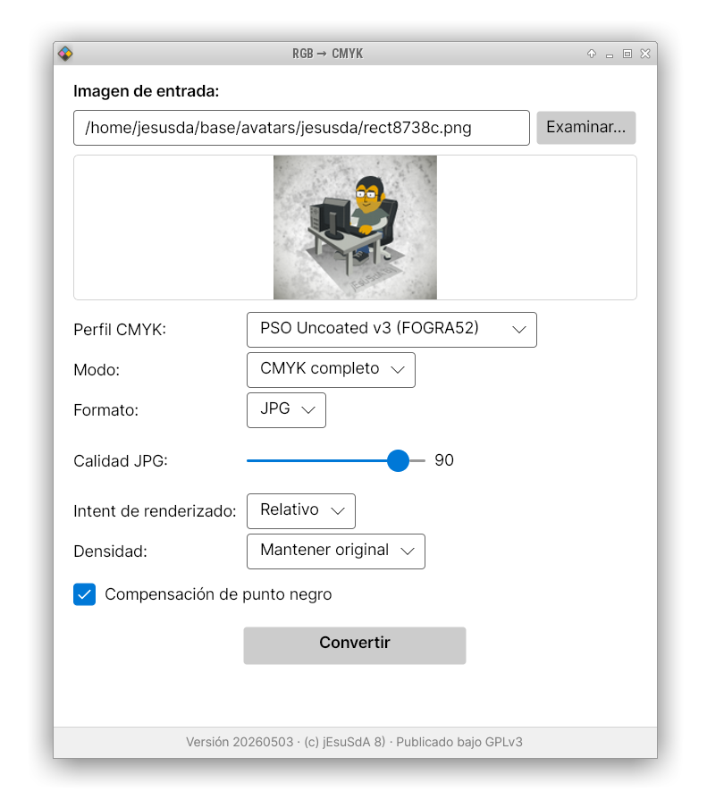

# RGB → CMYK

Conversor de imágenes de RGB a CMYK con perfiles ICC, para preparación de archivos de imprenta.

Incluye dos herramientas:

- **Scripts de línea de comandos** — conversión rápida desde terminal (requiere ImageMagick instalado)
- **Aplicación gráfica** — interfaz visual autocontenida, sin dependencias externas, para Linux, Windows y macOS

## Características

- Conversión RGB → CMYK completa con perfiles ICC
- Modo **K-Only**: escala de grises CMYK usando solo el canal K (tinta negra)
- Perfil CMYK incluido: **PSO Uncoated v3 (FOGRA52)**
- Perfil RGB fuente incluido: **sRGB IEC61966-2.1**
- Soporte para cargar perfiles ICC arbitrarios desde disco
- Formato de salida: JPG o TIFF (compresión Zip)
- Rendering intent configurable: Relativo, Perceptual, Saturación, Absoluto
- Compensación de punto negro (Black Point Compensation) configurable
- Calidad JPG ajustable (1–100)
- Densidad de salida: mantener original o forzar 300 ppi
- Vista previa de la imagen antes de convertir
- Íntegramente en español





---

## Descarga e instalación

Descarga los binarios desde la página de [Releases](../../releases).

### Linux (x64)

1. Descarga `rgb2cmyk-gui-linux-x64.tar.gz`
2. Descomprime:
   ```bash
   tar xzf rgb2cmyk-gui-linux-x64.tar.gz
   ```
3. Ejecuta:
   ```bash
   ./run.sh
   ```

> **Nota**: Si tu sistema tiene `gtk3-nocsd` instalado, la app se ejecuta automáticamente con `LD_PRELOAD` desactivado vía `run.sh`. Si experimentas problemas ejecutando el binario directamente, usa `LD_PRELOAD= ./rgb2cmyk-gui`.

Dependencias del sistema (normalmente ya instaladas en distribuciones con escritorio):
```bash
sudo apt install libfontconfig1 libice6 libsm6
```

### Windows (x64)

1. Descarga `rgb2cmyk-gui-win-x64.zip`
2. Descomprime en la carpeta que quieras
3. Ejecuta `rgb2cmyk-gui.exe`

No necesita instalar .NET ni ningún otro software.

### macOS (Apple Silicon — M1/M2/M3)

1. Descarga `rgb2cmyk-gui-macOS-arm64.zip`
2. Descomprime
3. Arrastra `rgb2cmyk-gui.app` a la carpeta Aplicaciones
4. Abre la app desde Aplicaciones

> La primera vez, macOS puede mostrar un aviso de seguridad porque la app no está firmada con certificado Apple. Para abrirla: clic derecho → Abrir → confirmar en el diálogo.

---

## Uso de la aplicación gráfica

1. Pulsa **Examinar** para seleccionar una imagen de entrada (JPG, PNG, TIFF, BMP, WebP)
2. Configura las opciones de conversión:
   - **Perfil CMYK**: perfil embebido o carga uno propio desde disco
   - **Modo**: CMYK completo o Solo canal K
   - **Formato**: JPG o TIF
   - **Calidad JPG**: solo visible si el formato es JPG
   - **Intent de renderizado**: cómo se mapean los colores fuera de gama
   - **Densidad**: mantener la del original o forzar 300 ppi
   - **Compensación de punto negro**: activado por defecto (recomendado)
3. Pulsa **Convertir**
4. El archivo de salida se genera en la misma carpeta que el original, con sufijo `_CMYK` o `_CMYK-Key-only`

---

## Scripts de línea de comandos

Requieren ImageMagick instalado (`convert`). Los perfiles ICC deben estar en el mismo directorio que el script.

### CMYK completo

```bash
./img2cmyk.sh imagen.jpg          # salida JPG
./img2cmyk.sh imagen.jpg tif      # salida TIFF
```

### Solo canal K

```bash
./img2cmyk-black-only.sh imagen.jpg   # salida TIFF siempre
```

> **Nota**: Estos scripts tienen `MAGICK_TMPDIR` configurado a `/tmp`. Si tu /tmp no tiene espacio suficiente para trabajar, edita los scripts y elige otra ruta donde sí haya espacio suficiente de sobra.

---

## Tecnología

| Componente | Tecnología |
|---|---|
| Lenguaje | C# (.NET 8) |
| Interfaz gráfica | Avalonia UI 11 (Fluent theme) |
| Procesamiento de imagen | Magick.NET 14 (ImageMagick Q8, embebido) |
| Perfiles ICC | Embebidos como recursos del binario |
| Build | `dotnet publish` self-contained |
| Cross-compile | Linux → Windows, macOS (binarios nativos vía NuGet) |

### Compilación desde código fuente

```bash
cd rgb2cmyk-gui
source setup.sh      # descarga .NET 8 SDK localmente (sin tocar el sistema)
./build.sh           # compila Linux x64, Windows x64 y macOS ARM64
```

Los binarios se generan en:
- `publish/linux-x64/` (~130 MB)
- `publish/win-x64/` (~120 MB)
- `publish/osx-arm64/rgb2cmyk-gui.app` + `rgb2cmyk-gui-macOS-arm64.zip` (~55 MB comprimido)

---

## Licencia

GPLv3 — ver [LICENSE](LICENSE)

© jEsuSdA 8)
